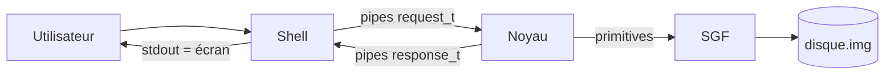

# Architecture générale

## Objectif

Réaliser en C un **émulateur de SGF** piloté par un **mini-shell**, en reproduisant de façon simplifiée la chaîne Unix :



## Modules

| Répertoire | Responsabilité |
|------------|----------------|
| `shell/` | Prompt, lecture stdin, parsing, affichage stdout |
| `kernel/` | Processus fils, table de dispatch, handlers de commandes |
| `fs/` | Disque, bitmaps, inodes, répertoires, primitives `_my*` |
| `ipc/` | Pipes + sérialisation `request_t` / `response_t` |
| `common/` | Types, constantes, codes d’erreur |
| `doc/` | Conception et documentation |

## Processus

Au démarrage du binaire `bin/shell` :

1. Création de **deux pipes** (requêtes et réponses).
2. **Un seul `fork()`** : le fils exécute `kernel_loop()`, le père reste le Shell.
3. Le Noyau monte `data/disque.img` (formatage automatique si absent).
4. Boucle interactive jusqu’à `exit`.

Les commandes **ne sont pas forkées** : ce sont des appels de fonctions dans le processus Noyau (contrairement à Bash qui lance souvent `/bin/ls` via `exec`).

## Flux d’une commande

```text
1. Utilisateur tape :  ls -l docs
2. Shell (parser)   →  request_t { type=CMD_LS, args=["-l","docs"] }
3. Pipe             →  Noyau
4. cmd_dispatch     →  cmd_ls() → fs_list() → …
5. Pipe             ←  response_t { status, output="…" }
6. Shell            →  printf(output)  // terminal = écran
```

## L’« écran »

Dans ce projet, l’écran du sujet est le **terminal** qui affiche le `stdout` du Shell.  
Pas de processus d’affichage séparé ni de FIFO : le Shell gère saisie **et** restitution des résultats.

## Persistance

Tout l’état durable du SGF est dans `data/disque.img`.  
Fermer puis relancer le Shell conserve l’arborescence (et l’espace libéré après `rm` / `rmdir` reste réutilisable).
