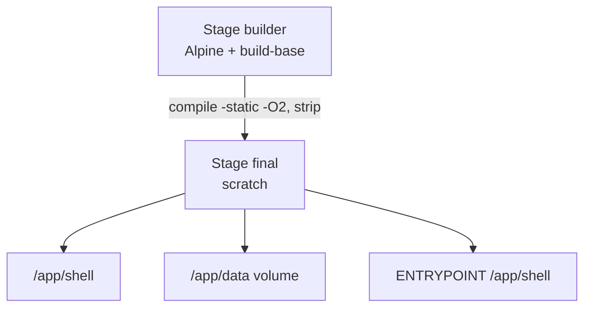

# Conteneurisation

## Objectif

Fournir un environnement **reproductible** et une image **minimale** pour exécuter Mon D.O.S. sans toolchain sur la machine hôte.

## Build multi-stage



- **Builder** : jeté après compilation → pas de compilateur dans l’image finale.
- **scratch** : aucune distro ; uniquement le binaire **lié statiquement** (musl).
- Taille typique : de l’ordre de **~130 Ko**.

## Persistance

```bash
docker run --rm -it -v "$(PWD)/data:/app/data" mdos-nsy103
```

Le volume monte le répertoire `data/` de l’hôte sur `/app/data` dans le conteneur : `disque.img` survit à la destruction du conteneur.

## Fichiers

| Fichier | Rôle |
|---------|------|
| `Dockerfile` | Multi-stage |
| `.dockerignore` | Exclut PDF, `.git`, objets, etc. du contexte de build |

Raccourcis Makefile : `make docker-build`, `make docker-run`.
